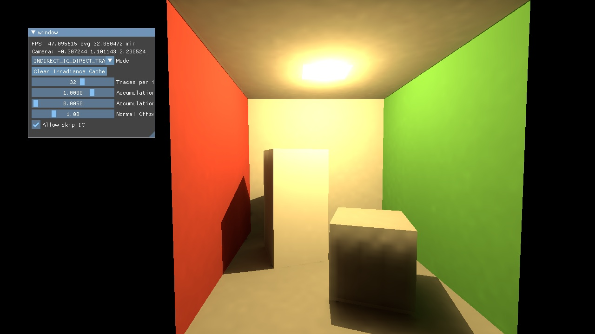

<!-- Allow this file to not have a first line heading -->
<!-- markdownlint-disable-file MD041 -->

<!-- inline html -->
<!-- markdownlint-disable-file MD033 -->

<div align="center">

# Foray Irradiance Cache

**A simple world space irradiance cache implemented by [@Firestar99](https://github.com/Firestar99)**
</div>

[](https://www.youtube.com/watch?v=4QpiDKBqSW4)

[Short video showcase](https://www.youtube.com/watch?v=4QpiDKBqSW4)

Loosely based on [DDGI](https://jcgt.org/published/0008/02/01/), this irradiance cache uses simple point light-like probes that do not actually have any directionality. Instead, each Probe is placed on a world space 3D grid, which is backed by a 3D texture and most of the work has gone into sampling it correctly. This Project was build as part of a Master's Project worth 10 ETCS, and build upon the [foray framework](https://github.com/Vulkemp/foray) made by [Joseph Heetel](https://github.com/Joseph-Heetel) and [Max](https://github.com/maxthi) as their master thesis.

If you're looking for code written by me, have a look at [this readme](./examples/irradiance-cache/README.md).

## Setup

```
git clone --recursive https://github.com/Vulkemp/foray-examples
```
`--recursive` clones the required submodule `foray`. Then import it into your IDE as a cmake project, or use cmake directly. Run the `irradiance-cache` binary for the main executable. Pre-build binaries are not available as the project is not setup to run outside a development environment.

## Tested Build Environments
* Linux RADV
* Windows Nvidia
* sadly AMDVLK / AMD on Windows does not work, it segfaults inside the driver stack during raytrace pipeline initialization

## Controls
* WASD: standard movement
* Shift/Ctrl: move up / down
* space: lock/unlock mouse to rotate camera
* C: clear irradiance cache
* T/G: previous / next Mode

## Settings
* Traces per Frame: how many traces should be sent out per frame and probe, higher values trade worse performance for faster accumulation
* Accumulation Quality: adjusts accumulation factor to match traces per frame so the image quality remains mostly constant, higher values trade worse accumulation speed for better final image quality
* Accumulation Factor: the percentage by which the newly sampled values should be mixed with the previous values, higher values trade accumulation speed for better final image quality
* Normal Offset Factor: When sampling some geometry, the light will be sampled from the irradiance cache at the position the geometry was hit plus the normal of the geometry times this factor
* Alow skip IC: If a mode does not use the irradiance cache (IC) allow it to skip the accumulation stages, used to estimate overhead introduced by running stages doing nothing

Settings in code `examples/irradiance-cache/src/IrradianceCacheApp.cpp`:
* SCENE_FILE: path to the gltf scene file from the `/data` directory
* PROBE_DISTANCE: the distance between individual probes of the irradiance cache, with the size of the scene will determine the probe dimensions
* INVERT_BLIT_INSTEAD: If true, will invert the viewport when blitting. If false, will invert the scene while loading to -Y up.
* USE_CAMERA_FROM_GLTF: instead of an interactable camera load it from the gltf, useful for comparison against other renderers.

