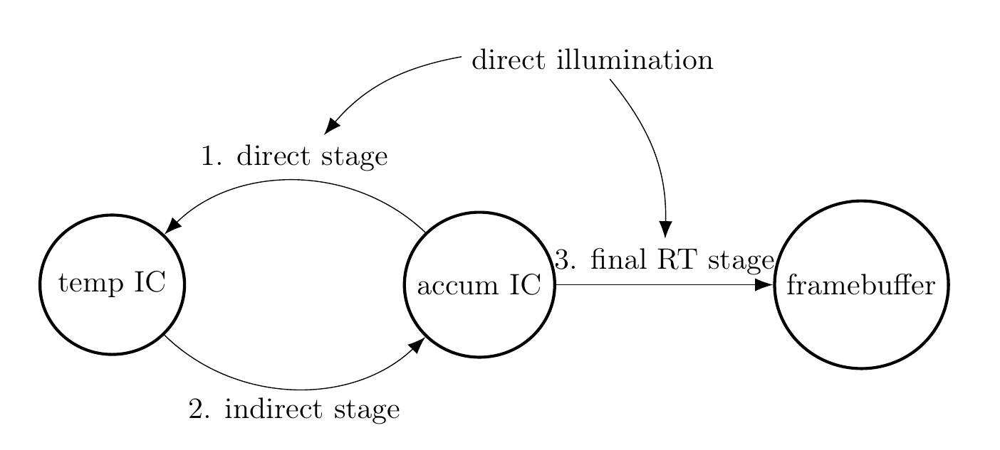

# Irradiance Cache example



The [IrradianceCache](src/IrradianceCache.h) type is the main data structure, owning the `temp IC` and `accum IC` 3D textures, managing the push constant configuring size and position of the irradiance cache and holding the state configured in the ImGui. The [IrradianceCacheApp](src/IrradianceCacheApp.h) is the root of the application where everything is tied together, containing both the Irradiance Cache data structure as well as all the stages required to update it.

## Stages
### 1. [IrradianceCacheDirectStage](src/IrradianceCacheDirectStage.h)
```
direct illumination = raycast(texel center to lights)
tempIC[pixel] = accumIC[pixel] + direct illumination
```
Copies the irradiance from the accumulation Irradiance Cache (`accum IC`) to the temporary IC (`temp IC`) and adds the direct illumination of the probe on top. This stage exists solely so that later stages don't need to trace more ray to evaluate direct illumination when sampling the Irradiance Cache.

[raygen](./shaders/irradiancecache/direct/raygen.rgen), [direct light](./shaders/directlight.glsl), [visitest](./shaders/visitest/visitest.glsl), [visitest anyhit](./shaders/visitest/anyhit.rahit), [visitest miss](./shaders/visitest/miss.rmiss)


### 2. [IrradianceCacheIndirectStage](src/IrradianceCacheIndirectStage.h)
```
uniform temporalSpeed = [0.85 0.98]
accumLight = 0
for (N times) {
    nearbySurface = raycast(texel center to random direction)
    accumLight += sampleIrradianceCache(tempIC, nearlySurface) * material(nearbySurface)
}
accumIC[pixel] = lerp(accumLight, accumIC[pixel], temporalSpeed)
```
For each probe, traces N rays in a random spherical direction and sample the hit material with light sampled from the temporary irradiance cache. Then the accumulated IC is updated by linearly interpolating the accumulated light from this frame with the light from all previous frame by some factor `temporalSpeed`. The higher this factor the faster changes in light conditions will propagate, but will also make fireflies much more noticeable as illumination flickers. Note that the accumulation IC only accumulates indirect illumination and specifically excludes any direct illumination of the first bounce.

[raygen](./shaders/irradiancecache/indirect/raygen.rgen), [probemat](./shaders/probemat/probemat.glsl), [probemat anyhit](./shaders/probemat/anyhit.rahit), [probemat closesthit](./shaders/probemat/closesthit.rchit), [probemat closesthit](./shaders/probemat/miss.rmiss)


### 3. [FinalRTStage](src/FinalRTStage.h)
```
surface = raycast(camera to pixel direction)
direct illumination = raycast(surface to lights)
indirect illumination = sampleIrradianceCache(indirectImage, surface)
outImage = direct illumination + indirect illumination
```
The final RT stage just traces rays from the camera into the scene to generate the final image. The direct illumination is calculated from shadow ray casts for best precision, whereas the indirect illumination is sampled from the accumulation IC.

[raygen](./shaders/finalrt/raygen.rgen), uses the same probemat and visitest shaders like previous stages


### SwapCopyStage
Simply blits the output image to the swapchain.
